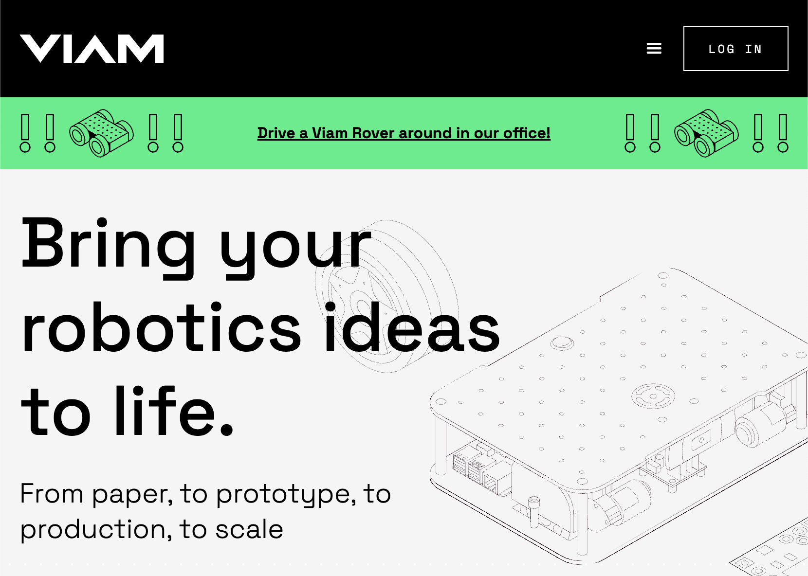
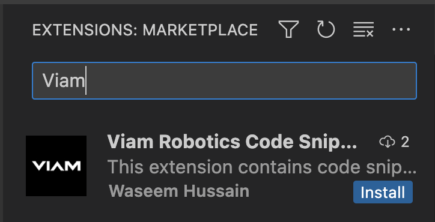

# Viam Robotics VSC Code Snippets

## Overview

This is a VS Code extension that offers a collection of code snippets for [Viam Robotics](https://www.viam.com/). It lets you build your robot application faster by providing predefined code snippets for common coding tasks related to Viam.

- 😄 If you find this extension helpful please share with your friends and consider giving it a [positive review](https://marketplace.visualstudio.com/items?itemName=waseemhnyc.viam-robotics-vsc-code-snippets&ssr=false#overview).

- 🐞 Notice an issue? Reach out on [Twitter](https://twitter.com/waseemhnyc).

- 👨‍💻 This is an unofficial extension and managed by me, [Waseem](https://twitter.com/waseemhnyc).

I'm currently exploring/building in AI, AR/VR and Robotics and sharing my journey on [Twitter](https://twitter.com/waseemhnyc).

------

<h4>My hope is that this extension can accelerate your development process when working with Viam Robotics. Happy Building!</h4>

------

<!-- ## Compatibility

This extension requires Visual Studio Code version 1.79.0 or above. -->

<!-- ## Features

The extension contributes to the Python language service by providing snippets defined in `./snippets/snippets.code-snippets`. When working in a Python file, you can quickly insert Viam Robotics related code snippets by typing the prefix of the snippet and selecting the snippet from the IntelliSense suggestions. -->

<!-- ## Categories

This extension falls under the "Snippets" category. -->

## Installation

To install this extension, follow the standard procedure for installing Visual Studio Code extensions:

1. Open Visual Studio Code.
2. Open the Extensions pane.
3. Search for "Viam Robotics Code Snippets".
4. Click Install.

## Usage

To use a snippet, open a Python file and start typing the prefix of the snippet you want to use. The snippet should appear in the IntelliSense suggestions. You can then insert it by clicking on it or pressing the Tab or Enter key.

## Snippets

These snippets follow a convention to make it easier to use. As you are typing, the intellisense dropdown will show you related snippets.

<strong>Convention</strong>

- All snippets start with `_v`.
- Adding a template start with `_vt` then the name of the template. Ex: `_vtmain`.
- Adding a component start with `_vc` then the name of the component. Ex: `_vcsensor`.
- Importing components have the same command as adding a component, but with _import at the end. Ex: `_vcsensor_import`.

<strong>Templates</strong>

| Command | Description |
| --- | ----------- |
| `_vtconnect` | Establish a connection to a robot with an address or channel. |
| `_vtmain` | Template that establishes a connection to a robot with a main async event loop. |

<strong>Components</strong>

| Command | Description |
| --- | ----------- |
| `_vcarm` | Initializes an Arm object. |
| `_vcbase` | Initializes a Base object. |
| `_vcboard` | Initializes a Board object. |
| `_vccamera` | Initializes a Camera object. |
| `_vccontroller` | Initializes a Controller object and handles its controls and events. |
| `_vcencoder` | Initializes an Encoder object. |
| `_vcgantry` | Initializes a Gantry object. |
| `_vcgripper` | Initializes a Gripper object. |
| `_vcmotor` | Initializes a Motor object. |
| `_vcmovementsensor` | Initializes a Movement Sensor object. |
| `_vcsensor` | Initializes a Sensor object. |
| `_vcservo` | Initializes a Servo object. |

<strong>Component Imports</strong>

| Command | Description |
| --- | ----------- |
| `_vcarm_import` | Import Arm component. |
| `_vcbase_import` | Import Base component. |
| `_vcboard_import` | Import Board component. |
| `_vccamera_import` | Import Camera component. |
| `_vccontroller_import` | Import Controller components. |
| `_vcencoder_import` | Import Encoder component. |
| `_vcgantry_import` | Import Gantry component. |
| `_vcgripper_import` | Import Gripper component. |
| `_vcmotor_import` | Import Motor component. |
| `_vcmovementsensor_import` | Import Movement Sensor component. |
| `_vcsensor_import` | Import Sensor component. |
| `_vcservo_import` | Import Servo component. |

## Contributing

Feel free to submit pull requests if you want to add more snippets or improve the existing ones.

## Contact

If you have any questions or issues, please open an issue on the GitHub repository. Or reach out to Waseem via Twitter or Email.

## License

The project is licensed under the MIT License. See the LICENSE file for details.
